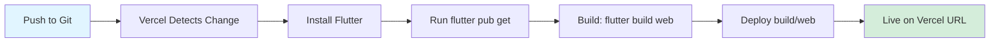

# Deployment Guide: Frusette Kitchen Web Dashboard

This guide covers deploying the Frusette Kitchen Web Dashboard to Vercel with automated CI/CD.

## Prerequisites

Before deploying, ensure you have:

1. **Git Repository**: Your code must be in a Git repository (GitHub, GitLab, or Bitbucket)
2. **Vercel Account**: Sign up for free at [vercel.com](https://vercel.com)
3. **Flutter Installed Locally** (for testing): [Install Flutter](https://flutter.dev/docs/get-started/install)

## Quick Start

### Step 1: Push Your Code to Git

If you haven't already, initialize a Git repository and push to your remote:

```bash
git init
git add .
git commit -m "Initial commit"
git remote add origin <your-repository-url>
git push -u origin main
```

### Step 2: Connect to Vercel

1. Go to [vercel.com/new](https://vercel.com/new)
2. Sign in with your Git provider (GitHub, GitLab, or Bitbucket)
3. Import your repository
4. Vercel will auto-detect the configuration from `vercel.json`
5. Click **Deploy**

### Step 3: Automatic Deployments

Once connected, Vercel automatically:
- Builds and deploys on every push to `main` branch
- Creates preview deployments for pull requests
- Provides unique URLs for each deployment

## Configuration Files

### vercel.json

The `vercel.json` file configures:
- **Build Command**: Builds Flutter web app in release mode with CanvasKit renderer
- **Output Directory**: Specifies `build/web` as the deployment folder
- **Environment Variables**: Sets up Flutter and CanvasKit paths
- **Headers**: Adds necessary CORS headers for web workers
- **Rewrites**: Enables client-side routing (SPA behavior)

### .vercelignore

Excludes unnecessary files from deployment:
- Platform-specific folders (Android, iOS, etc.)
- Development tools and test files
- Git and IDE configuration

## Local Build Testing

Before deploying, test the build locally:

```bash
# Clean previous builds
flutter clean

# Get dependencies
flutter pub get

# Build for web (release mode)
flutter build web --release --web-renderer canvaskit

# Serve locally to test (optional)
cd build/web
python -m http.server 8000
# Then open http://localhost:8000
```

## Environment Variables

If your app requires environment variables (API keys, backend URLs, etc.), add them in Vercel:

1. Go to your project in Vercel Dashboard
2. Navigate to **Settings** → **Environment Variables**
3. Add your variables:
   - `API_BASE_URL`: Your backend API URL
   - Any other required variables

## Custom Domain

To add a custom domain:

1. In Vercel Dashboard, go to **Settings** → **Domains**
2. Add your domain name
3. Follow the DNS configuration instructions
4. Wait for DNS propagation (usually a few minutes)

## Troubleshooting

### Build Fails

**Issue**: Flutter installation fails during build

**Solution**: Vercel's build cache might be stale. Clear the cache:
1. Go to **Settings** → **General** → **Build & Development Settings**
2. Clear build cache and redeploy

### White Screen After Deployment

**Issue**: App loads but shows blank screen

**Solution**: Check browser console for errors. Common fixes:
- Ensure `--web-renderer canvaskit` is specified in build command
- Verify all assets are properly referenced in `pubspec.yaml`
- Check that CORS headers are properly configured in `vercel.json`

### Routing Not Working

**Issue**: Direct URLs return 404

**Solution**: The `vercel.json` rewrite rules should handle this. Verify:
```json
"rewrites": [
  {
    "source": "/(.*)",
    "destination": "/index.html"
  }
]
```

### Build Takes Too Long

**Issue**: Vercel build times out (>15 minutes free tier, >45 minutes paid)

**Solution**: 
- Ensure `.vercelignore` excludes unnecessary files
- Consider caching strategies for Flutter installation
- Check for any large assets that can be optimized

## Manual Deployment (Vercel CLI)

For manual deployments using Vercel CLI:

```bash
# Install Vercel CLI globally
npm i -g vercel

# Login to Vercel
vercel login

# Deploy to preview
vercel

# Deploy to production
vercel --prod
```

## Deployment Workflow



## Monitoring & Analytics

Vercel provides built-in analytics:
- **Deployments**: View all deployment history and logs
- **Analytics**: Track page views and performance (Pro plan)
- **Speed Insights**: Monitor Core Web Vitals
- **Logs**: Real-time function and build logs

Access these in your Vercel Dashboard under your project.

## Best Practices

1. **Branch Deployments**: Use preview deployments for testing before merging to main
2. **Environment Separation**: Use different environment variables for staging/production
3. **Performance**: Monitor bundle size and optimize assets regularly
4. **Security**: Never commit sensitive keys; use Vercel environment variables
5. **Version Control**: Tag releases in Git for easy rollbacks

## Support

- **Vercel Documentation**: [vercel.com/docs](https://vercel.com/docs)
- **Flutter Web**: [flutter.dev/web](https://flutter.dev/web)
- **Community**: [Vercel Discord](https://vercel.com/discord)

## Next Steps

- [ ] Set up custom domain
- [ ] Configure environment variables for backend API
- [ ] Set up staging environment (separate branch)
- [ ] Enable Vercel Analytics
- [ ] Configure GitHub/GitLab CI status checks
